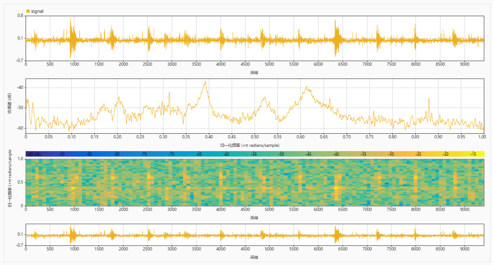
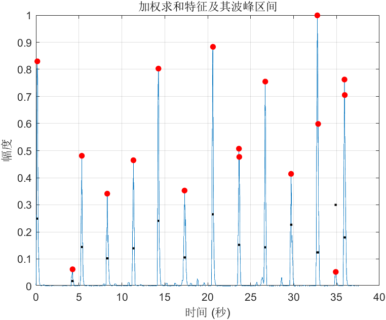
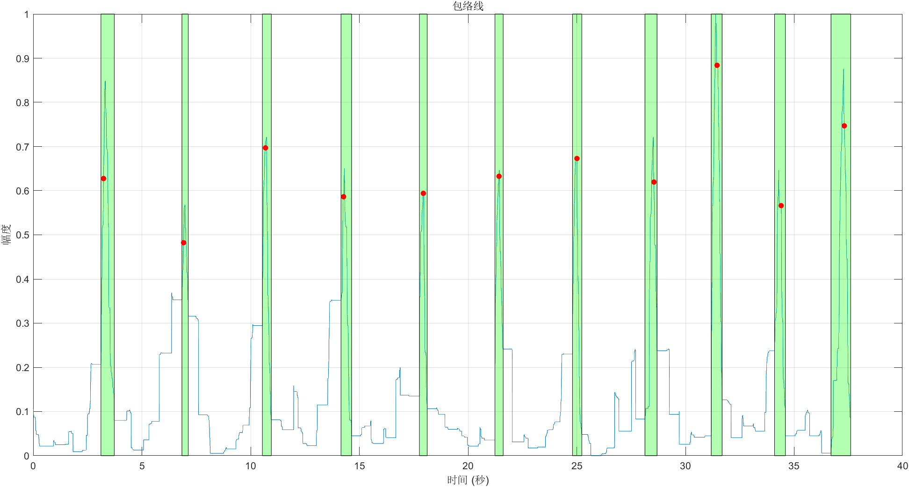

# 有效区间检测（所有波形）
本工程实现了对所有波形的有效区间检测，检测后的文件输出为`dataset_with_valid_measurements.csv`。其中包含了原始数据集的所有列，并新增了`ValidCount`列，用于记录有效区间的计数。

本代码主要负责加载数据集，处理信号，并将处理后的结果保存到新的文件中。其核心流程包括数据加载、信号降噪、特征提取以及有效信号段的识别与记录。

## 数据集加载

### 接口介绍

`DataLoader` 类用于加载和处理数据集，提供获取工件和测量ID以及提取数据的方法。

#### 构造函数

**`DataLoader(file_path)`**

- **描述**：加载指定路径的数据集。
- **参数**：`file_path` (字符串)：数据集文件路径。

#### 方法

**`getWorkpieceIDs()`**

- **描述**：获取所有工件的唯一ID。
- **返回值**：工件ID数组。

**`getMeasurementIDs(workpiece_id)`**

- **描述**：获取指定工件的测量ID。
- **参数**：`workpiece_id` (标量)：工件ID。
- **返回值**：测量ID数组。

**`getMeasurementData(workpiece_id, measurement_id)`**

- **描述**：提取指定工件和测量的数据。
- **参数**：
  - `workpiece_id` (标量)：工件ID。
  - `measurement_id` (标量)：测量ID。
- **返回值**：包含数据的表格。

#### 使用示例

以下示例展示了如何使用`DataLoader`类加载数据集并遍历每个工件和测量。

```matlab
data_loader = DataLoader('dataset.csv');
workpiece_ids = data_loader.getWorkpieceIDs();
for i = 1:length(workpiece_ids)
    workpiece_id = workpiece_ids(i);
    measurement_ids = data_loader.getMeasurementIDs(workpiece_id);
    for j = 1:length(measurement_ids)
        measurement_id = measurement_ids(j);
        data = data_loader.getMeasurementData(workpiece_id, measurement_id);
        disp(data);
    end
end
```


### 主要步骤

1. **加载数据集**：
    - 使用 `readtable` 函数加载 CSV 文件中的数据。
    - 初始化数据表中的 `ValidCount` 列，用于存储有效信号段的计数。

2. **初始化类**：
    - 创建 `DataLoader` 类的实例，用于管理数据集的加载与处理。
    - 设置有效波形的阈值 `valid_waveform_threshold`。

3. **遍历处理每个工件和测量**：
    - 获取所有工件的 ID。
    - 对于每个工件，获取其所有测量的 ID。
    - 对于每个测量，提取信号数据并进行处理。
    - 对信号进行降噪和特征提取。
    - 识别有效信号段并记录到数据表中。

4. **保存处理结果**：
    - 将处理后的数据表写入新的 CSV 文件。

### 数据集加载与处理流程

1. **数据加载**：
    - 调用 `readtable` 函数读取 `dataset.csv` 文件，将数据存储到 `dataset_df` 表格中。
    - 初始化 `ValidCount` 列，默认值设为 `-1`。

2. **DataLoader 类初始化**：
    - 通过 `DataLoader('dataset.csv')` 初始化数据加载类，将数据表加载到类的 `dataset_df` 属性中。

3. **获取工件和测量的 ID**：
    - 通过 `getWorkpieceIDs` 方法获取所有工件的唯一 ID 列表。
    - 通过 `getMeasurementIDs(workpiece_id)` 方法获取指定工件的所有测量 ID 列表。

4. **获取测量数据**：
    - 通过 `getMeasurementData(workpiece_id, measurement_id)` 方法获取指定工件和测量的信号数据。

5. **信号处理**：
    - 对获取的信号数据进行降噪处理和特征提取。
    - 通过 `SignalProcessor` 类的相关方法进行处理。

6. **记录有效信号段**：
    - 识别有效信号段，并在 `dataset_df` 表格中记录有效信号段的计数。

7. **保存处理结果**：
    - 将处理后的数据表保存到新的 CSV 文件 `dataset_with_valid_measurements.csv` 中。

## 信号处理

本次测试中处理的信号波形如下图所示。时域图和频谱图如下所示。




信号组成的初步分析：
- 有效信号：持续时间较长，振幅较高的振荡信号。
- 无效信号：
    - 持续时间较短，振幅较高的尖峰毛刺
    
    - 振幅较小的传送带抖动噪声。
    

信号的时域图和频谱图打开`extract/signal_analysis.mldatx`即可查看。

可以发现，噪声的干扰较为丰富，包括全频段的干扰，从毛刺突变到传送带的突然抖动。信号有相当大一部分集中在0.3~0.7频段，但是也不能简单的作为分离依据。存在很多和信号频率相近的噪声干扰。通过肉眼观察也只有幅值上的区别。更细致的分析需要后续的观察。


### 1. 降噪处理

降噪是信号处理的第一步，目的是去除信号中的噪声，使得信号更加清晰。

#### 方法：`denoiseSignal`

```matlab
function denoised_signal = denoiseSignal(signal)
    denoised_signal = wdenoise(signal, 10, ...
        'Wavelet', 'sym2', ...
        'DenoisingMethod', 'BlockJS', ...
        'ThresholdRule', 'James-Stein', ...
        'NoiseEstimate', 'LevelIndependent');
    denoised_signal = detrend(denoised_signal);
end
```

#### 处理流程：

1. **小波降噪**：使用小波变换（`sym2`小波），选择了BlockJS降噪方法，James-Stein阈值规则，以及与层级无关的噪声估计方式对信号进行降噪。
2. **基线去除**：应用`detrend`函数去除信号中的线性趋势，以便后续分析。第四次和第五次的测量，传送带存在较大的偏移，需要通过基线去除来消除这种影响。

小波降噪的结果如下图所示。可以观察到，按照这个参数配置，小波降噪可以有效地去除信号中的噪声，提取出我们需要的较高幅值持续一定时间的振荡。可以发现，在有效信号的附近，由于传送带的抖动，会出现一些频域特征与有效信号非常相近的噪声，这些噪声也存在类似的振荡，小波变换无法分离这些噪声。这些只能通过后续更细致的特征提取来进行鉴别，目前采用的主要是持续时间和振荡的幅值来进行区分。


#### 原理与作用：

- **小波降噪**：利用小波变换将信号分解到不同的频率层级，再通过设定阈值剔除噪声。这种方法可以有效地分离信号和噪声，因为它能够捕捉到信号在时间和频率上的局部特征。
- **基线去除**：去除信号中的线性趋势，避免其对后续特征提取的影响。

### 2. 特征提取

特征提取是信号处理的第二步，目的是从降噪后的信号中提取有用的特征，以便后续的分析和处理。

#### 方法：`extractFeatures`

```matlab
function combined_feature = extractFeatures(signal, time)
    windowSize = 40;
    hopSize = 1;

    energy = SignalProcessor.computeShortTimeEnergy(signal, windowSize, hopSize);
    autocorr1D = sum(abs(SignalProcessor.computeShortTimeAutocorrelation(signal, windowSize, hopSize)), 1);

    energy_normalized = SignalProcessor.normalizeFeature(energy);
    autocorr1D_normalized = SignalProcessor.normalizeFeature(autocorr1D);

    combined_feature = 0.5 * energy_normalized + 0.5 * autocorr1D_normalized;
end
```

#### 处理流程：


1. **短时能量计算**：
    - 利用`computeShortTimeEnergy`方法，计算信号在滑动窗口内的能量。
2. **短时自相关计算**：
    - 利用`computeShortTimeAutocorrelation`方法，计算信号在滑动窗口内的自相关值。


3. **特征归一化**：
    - 利用`normalizeFeature`方法，将能量和自相关特征归一化。
4. **特征组合**：
    - 将归一化后的能量特征和自相关特征按比例（各占50%）组合成最终特征。


5. **闭运算**：
    - 对特征进行闭运算，连接相邻的波峰。


#### 原理与作用：

- **短时能量**：表示信号在特定时间段内的能量，用于衡量信号的**强度**变化。
- **短时自相关**：用于分析信号在特定时间段内的**周期性**特征。
- **归一化**：将不同尺度的特征转换到同一尺度，以便后续处理和分析。
- **特征组合**：结合多种特征，提升特征的代表性和鲁棒性。
- **闭运算**：闭运算（Closing operation）是形态学滤波中的一种基本操作，主要用于消除小的暗点、填补图像中的小孔洞以及平滑对象的边缘。闭运算是通过先进行膨胀（Dilation）再进行腐蚀（Erosion）来实现的。

### 3. 对特征进行峰值检测和间隔合并
特征提取之后，算法会进行峰值检测和间隔合并，以进一步分析信号的关键特征。这部分的目的是识别信号中的显著变化点，并将这些变化点之间的间隔进行合并处理。

`detectFeaturesPeaks`接口用于检测信号中的峰值和间隔。

处理流程：

1. **峰值检测**：
    - 使用`findpeaks`函数在组合特征中检测峰值。参数包括最小峰值高度、最小峰值距离、最小峰值显著性和最小峰值宽度。
2. **峰值位置索引**：
    - 使用`ismember`函数将检测到的峰值位置映射到时间索引。
3. **峰值间隔计算**：
    - 调用`getPeakIntervals`方法，根据峰值位置和高度阈值计算峰值间隔。
4. **间隔合并**：
    - 调用`mergeIntervals`方法，将相邻的峰值间隔合并成一个较大的间隔。


前面的短时能量和短时自相关特征，检测到的波峰对应的就是原始信号`signal`中振幅较大、持续一定时间的振荡信号，而那些幅值很高但持续时间很短的尖峰毛刺和幅值较低的传送带抖动噪声应当被滤除。

观察到的特征图像如下所示，可以看到，通过特征提取和峰值检测，我们可以有效地识别出信号中的峰值，并将其映射到原始信号中。关于区间个数和大致范围上做的比较好，能够准确地识别到对应的有效信号。漏检和误检的情况得到了较好的改善。

目前阶段存在的问题是区间范围不够精准，有的区间偏大，有的区间偏小。
- 偏大：由于经过了闭运算和合并区间，导致存在噪声的区域容易被归类到有效区间中。
- 偏小：由于小波降噪过程中对信号进行了分解和重构，信号的有效成分是在减少的，因此提取得到的区间相比于原始信号的区间更小，不利于后续的分析。

因此，后续的工作需要对大致确定的区间进行更精细的提取，选择更准确的有效区间范围。具体来说就是一段幅值较高持续时间较长的连续震荡信号的区间，区间应该在振荡幅值衰减到较小值处停止。如果有效区间相邻区域有多个类似的信号，应该只取振幅最大的那个，其他的都是噪声，不应该被归类为有效信号。

### 4. 有效区间检测
根据特征提取的峰值区间，在原始信号的绝对值的包络线上进行进一步的峰值检测，以确定有效区间。

`detectValidIntervals`接口用于检测有效区间。

处理流程：

- **信号包络提取**：
    - 使用`envelope`函数提取信号的包络线，模式选择为`rms`。
- **闭运算**：
    - 对包络线进行闭运算，连接相邻的波峰。突出最显著的波峰。
- **峰值检测**：
    - 利用前面提取的特征峰值位置和区间，寻找包络线上的波峰和波谷，定位更精确的有效区间。

        - 波峰：继续使用前面特征值的波峰。可以观察到，特征波峰的位置和包络线上的波峰位置基本一致，虽然有一定偏差，但是仍然在波峰内，不影响定位波峰所在区间。
        - 波谷：从波峰开始向两端出发，当信号值小于波峰值的一定比例（`0.4`）且连续50个点的梯度都为0（平底）时，认为找到了波谷。

包络线的梯度图如下所示。
